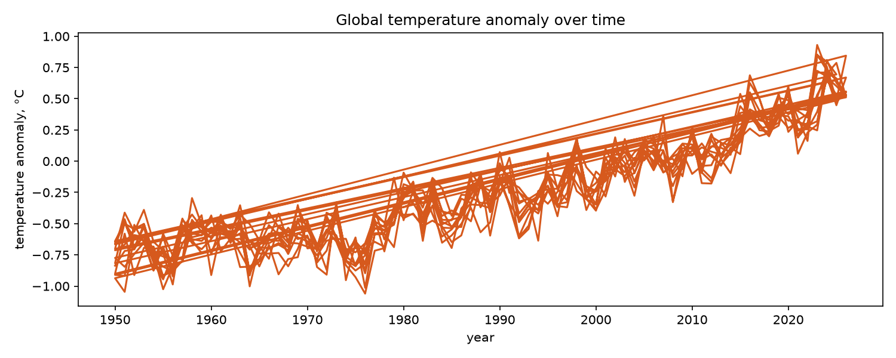

# The phenomenon

<!-- This is the SD5913 assignment 2 template. Everything in this file is yours to
replace, and the check counts words: comments like this one are not words, so
delete each one as you write. Start with the heading: name the phenomenon.

Then, in this order, at least 150 words in total.

New to folders, paths, or the files here whose names start with a dot? Read
https://github.com/sd5913/pfad/blob/2026/reference/files.md first. Ten minutes. -->



## The phenomenon
El Niño is a climate phenomenon linked to warmer-than-usual sea surface temperatures in the central and eastern tropical Pacific Ocean. It is part of the El Niño–Southern Oscillation (ENSO), which also includes La Niña, a period of cooler-than-usual sea surface temperatures. These changes can affect weather patterns in different parts of the world.

I chose this phenomenon because its strength changes over time. By looking at historical temperature data, I wanted to understand how warm and cool periods develop and change over the years.


## The source

https://ourworldindata.org/grapher/global-temperature-anomalies-by-el-nino-la-nina-and-month.csv?v=1&csvType=full&useColumnShortNames=false&utm_source=chatgpt.com

The dataset contains historical Oceanic Niño Index (ONI) values from 1950 onwards. ONI measures the three-month running average of sea surface temperature anomalies in the Niño 3.4 region of the tropical Pacific Ocean. The values are measured in degrees Celsius (°C). Positive values indicate warmer-than-usual conditions, while negative values indicate cooler-than-usual conditions.
## What the picture shows

The chart shows changes in global temperature anomalies from around 1950 to recent years. Overall, the values increase over time, although there are clear short-term fluctuations. This suggests that global temperatures have generally become warmer compared with the reference average.

However, the many overlapping lines make it difficult to compare different months and climate conditions. The chart also shows global averages, so it hides differences between regions. Although El Niño can influence global temperatures, this chart alone cannot prove that it causes the long-term warming trend.

## Run it

```
uv run fetch.py
uv run plot.py
```
